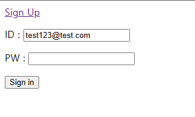
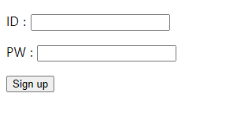
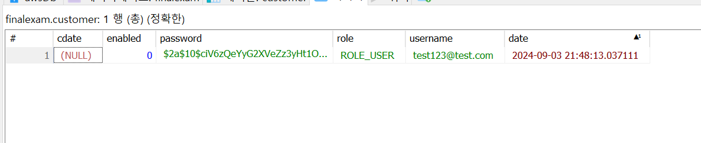
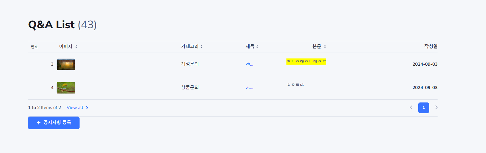
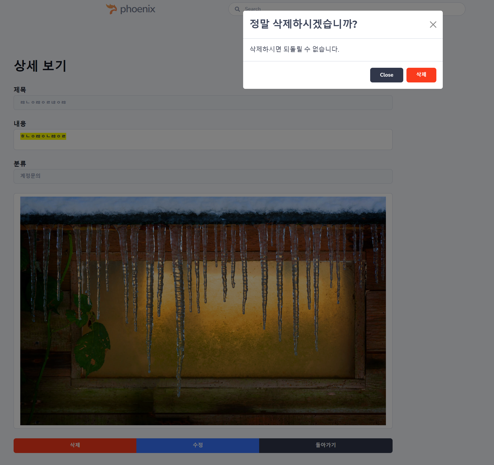
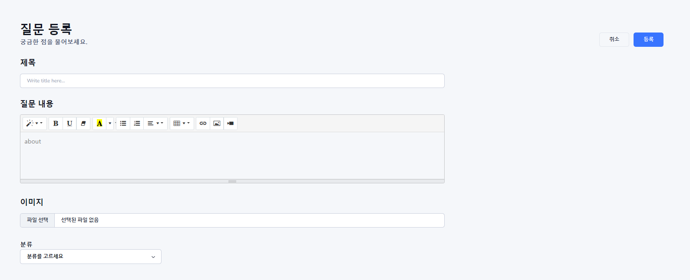
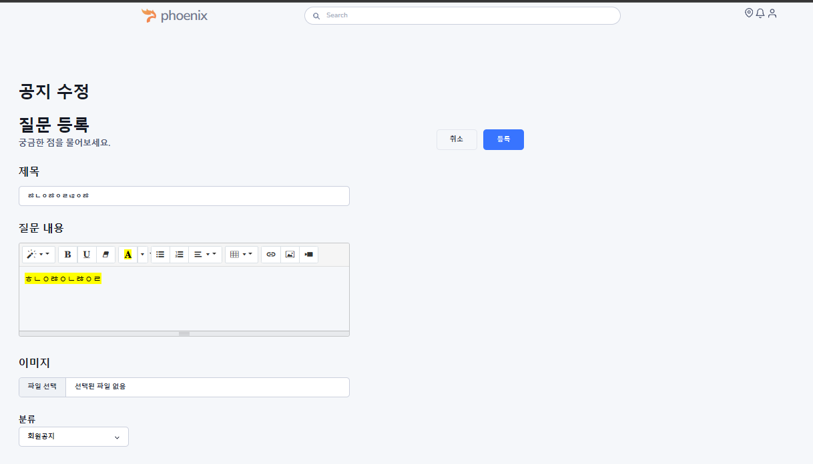

# Homework Exam

## 0903
- homeworkexam 프로젝트를 생성하세요 (이번주 금요일까지 이 프로젝트를 이용합니다.)
- 템플릿을 적용하세요 단, 여행사 템플릿(수업시간에 사용하는) 이외의 다른 템플릿을 사용하세요
  - e-commerce Wishlist 사용
- layout fragment를 적용하세요
- 스프링 시큐리티를 설정하세요 , 로그인 로그아웃 회원가입
- employee 테이블 username 즉 id 는 이메일로 받으세요
- id, username, password, enabled, role, addr, phone date
- QnA  질문게시판을 작성하세요 Qusetion 테이블과 Answer테이블을 자유롭게 연결하여 구성하세요
- 이번 숙제의 주제는 디자인입니다…
### 제출

- Signin 

- SignUp 

- DB

- List

- Detail

- Create
  

- Update
